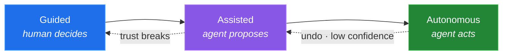

```
    ███╗   ███╗██╗ ██████╗██╗  ██╗███████╗██╗
    ████╗ ████║██║██╔════╝██║  ██║██╔════╝██║
    ██╔████╔██║██║██║     ███████║█████╗  ██║
    ██║╚██╔╝██║██║██║     ██╔══██║██╔══╝  ██║
    ██║ ╚═╝ ██║██║╚██████╗██║  ██║███████╗███████╗
    ╚═╝     ╚═╝╚═╝ ╚═════╝╚═╝  ╚═╝╚══════╝╚══════╝
    ─────────────────────────────────────────────
     P R O D U C T   D E S I G N E R  ·  16+ YRS
```

**I know what's worth building, and what isn't.**

I'm a hands-on lead product designer. Sixteen years in, my job is to decide what's worth building, shape how it gets built, and stay close enough to engineering that what ships matches what was designed.

Most designers hand off a file and hope. I write front-end code, so I meet the production constraints before I design, not after. Different order. Different outcome.

---

### What I actually do on a Tuesday

I lead design for agentic AI in enterprise data products. Not prototyping with AI tools: designing the agent's behavior itself. The UX contract for tool-calling, what actions it can take, what inputs it needs, what permissions constrain it, what the safe default is when it's unsure.

The hard part isn't the model. It's the trust ladder.



Every arrow is a design decision. The dotted ones matter most. An agent that can't walk back down the ladder is one bad answer away from losing the user for good. Trust climbs slowly and falls all at once.

---

### The thing I keep coming back to

Design systems don't fail on components. They fail on drift.

So I build tooling that makes the design system the ground truth an AI coding agent has to answer to. MCP servers, token pipelines, the plumbing between Figma and production. Prototyping that used to take days now takes hours. I use Figma Make, Claude Code, and Cursor in the actual design workflow, not just to make demos look fast.

Token-to-code parity is either real or it's a slide. I keep it real.

---

### Where I work

Enterprise software, developer platforms, and regulated domains. Mostly the messy end.

Financial risk and analytics. Pharmaceutical contracting. Healthcare platforms handling protected data. Field operations software built for people working offline, outdoors, one-handed. Design systems governed across many teams and many products. Lending products shipped against deadlines that did not move.

The pattern is consistent. Undefined problem, real regulatory weight, multiple user groups who want different things. The domain takes a month to understand before you draw anything.

---

### How I work

```
  ambiguity  ──▶  research  ──▶  system  ──▶  shipped
      │              │             │            │
   "nobody         talk to      make it     live, measured,
    knows           real         hold        and my problem
    yet"           users        at scale     if it breaks
```

I take the problems nobody has scoped yet, then stay through production. Consultancies get discounted for shipping and leaving. Fair. So I don't do that: I stay embedded long enough to answer for the decisions I made early on. Ownership is the whole differentiator.

---

### Stack

```
DESIGN     Figma · design tokens · Storybook · Code Connect · prototyping
AI         MCP servers · agentic UX · Claude Code · Cursor · Figma Make
RESEARCH   usability testing · behavioral analytics · UX audits · field validation
```

Figma-certified. Fullstory-certified. Bilingual, English and Spanish.

---

### Where I land

I want agents in the loop. I want more of them. What I don't want is a loop where nobody owns the judgment.

The test I use, and you should too: **what rejects the agent's output, and who decided the rule?**

If the answer is "nothing" and "nobody," that's not automation. That's drift with better branding.

---

### Away from the screen

Stock analysis. Automotive repair. Home improvement. Custom PC builds. Same instinct every time: take it apart, understand why it works, put it back better.

---

<a href="https://linkedin.com/in/michelvelis">LinkedIn</a> · West Palm Beach, FL</sub>
